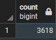
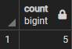
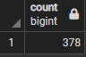
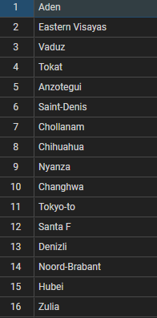
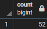
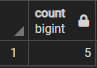

# SQL 실습

- dvdrantal 자료로 실습을 하였습니다.


1. 첫번째 문제
   1.  payment에서 5달러보다 큰 금액을 결제한 거래는 총 몇건 입니까?

```sql
SELECT amount FROM payment

WHERE amount > 5.00
```

- 첫번쨰 문제 정답.



2. 두번째 문제
   1.  이름이 P로 시작하는 영화배우는 몇명입니까?

```sql
SELECT COUNT(*) FROM actor

WHERE first_name LIKE 'P%'
```

- 두번째 문제 정답.

  

3. 세번쨰 문제 
   1.  고객 주소에서 중복되지 않는 고유한 지역은 몇개인가?

```sql
SELECT COUNT(DISTINCT(district)) FROM address
```

- 세번째 문제 정답.



4. 네번째 문제
   1.  이전 질문에서 중복되지 않는 지역의 명단을 조회해 보세요.

```sql
SELECT DISTINCT(district) FROM address
```

- 네번째 문제 정답



5. 다섯번째 문제

   1.  R 등급이고 교환 비용이 5달러와 15달러 사이인 영화는 몇 편인가?

   ```sql
   SELECT COUNT(*) FROM film
   
   WHERE replacement_cost BETWEEN 5.00 AND 15.00 AND rating = 'R'
   ```

   

- 다섯번째 문제 정답.



6. 여섯번째 문제

   1. 제목 어딘가에 Truman이라는 단어가 있는 영화는 몇편인가요?

   ```sql
   SELECT COUNT(*) FROM film
   WHERE title LIKE '%Truman%'
   # WHERE title LIKE '%_ruman%'
   ```

   

- 여섯번째 문제 정답.



SQL 첫번째 종합 도전 과제 완료!.